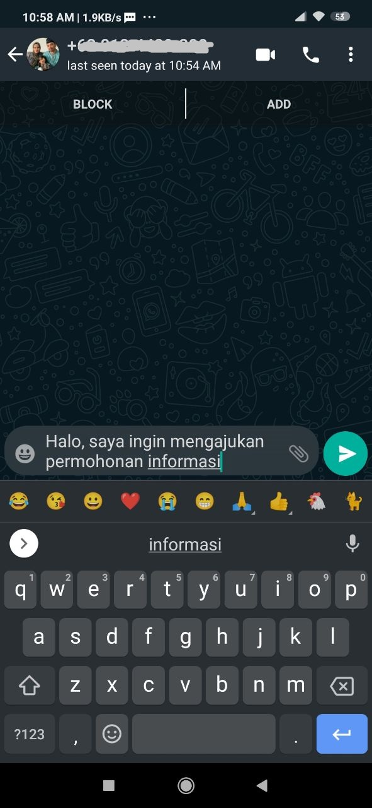

# Melakukan Permohonan Informasi

Akses permohonan Informasi tersedia di setiap halaman PPID, baik pada halaman utama, informasi, maupun dasar hukum.

Untuk melakukan permohonan informasi:

1. Pastikan anda berada pada salah satu halaman PPID.
2. Lakukan scroll kebawah menuju ke dasar halaman hingga anda menemukan elemen berikut:
   
3. Klik tombol "**Ajukan Permohonan Informasi**":
   
4. Setelah mengklik tombol "**Ajukan Permohonan Informasi**", anda akan dibawa ke halaman Whatsapp:
   
5. Silahkan klik tombol "**LANJUTKAN KE CHAT**" untuk menuju ke aplikasi WhatsApp (_jika anda menggunakan komputer, maka anda akan diarahkan ke web.whatsapp.com_) dimana anda dapat langsung berkomunikasi dengan pihak PPID desa untuk melakukan permohonan informasi.
   
   
